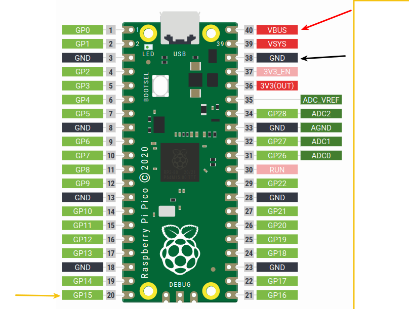
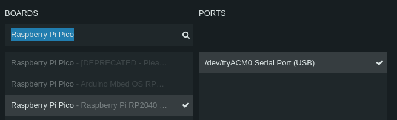
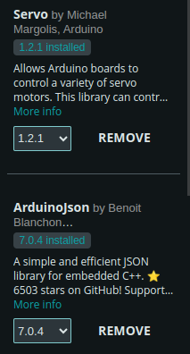

# IMPORTANT
DO NOT MODIFY THE CODE, THE CODE WAS PROVIDED FROM THE COURSE AND THE PROJECT DESCRIPTION MENTIONS THAT IT MUST NOT BE MODIFIED.

# How to run the pico
The breadbord has 3 wires connected: red, black, yellow.

The Servo motor has 3 wires: Brown, red, orange.

Connect red to red. Black to brown. Yellow to orange.

If wires has been removed from the breadboard then see the following pictures:

Pico pinout, see arrows on picture:

# Compiling from arduino
It should not be necessary to compile the arduino file again, but IF it is needed then do the following:

Press and hold the boot button on the Raspberry pi pico while connecting the USB to the computer. You know it is correct when you get a Pico USB thing popup. 

Open arduino, edit settings to fetch boards from: https://github.com/earlephilhower/arduino-pico/releases/download/global/package_rp2040_index.json

Use the board on the following picture:

Libraries to install:
- ArduinoJson from Benoit Blanchon 
- Servo from Michael Margolis, Arduino

Picture: 